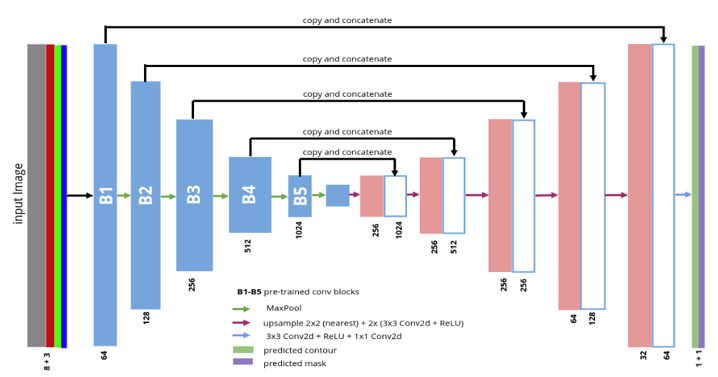
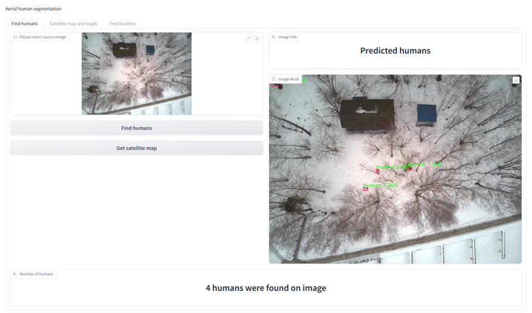
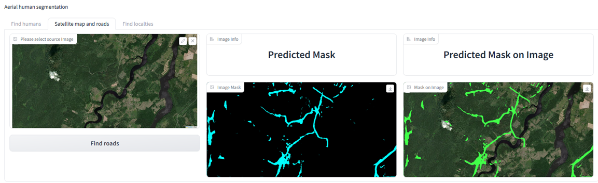
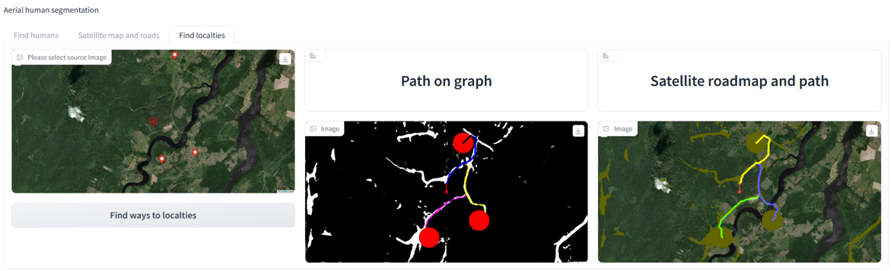

# UAV_imagery_processing
**An application to process UAV imagery to search for people and analyze their location, terrain topography and paths to the nearest settlements**

Description:

An application for segmentation and processing of images received from UAVs and satellites.
The developed application efficiently performs segmentation and counting of living objects on aerial images. The geometry is read from the acquired image and a satellite image of the terrain is loaded. On it, roads are segmented quickly and with sufficient quality.
Also the nearest settlements are precisely located on the image and the best ways to reach them are quickly calculated using the recognized roads.
The modified TernausNet model efficiently copes with segmentation on aerial images and quickly generates masks.
The created application can be useful in many areas where it is necessary to recognize and analyze living objects, in rescue and reconnaissance operations.

Model structure:

Detecting humans on aerial image:

Loading satellite image from Google Earth based on GPS coordinates, provided by EXIF from aerial image, then segmentating roads on this satellite image:

Loading satellite image from ArcGIS based on GPS coordinates, provided by EXIF from aerial image:

Based on area, where humans were detected, also list of nearest locations and their coordinates from Google Earth, calculating most efficient ways to get from detected humans to nearest locations by recognized roads (using Dijkstra algorithm):

